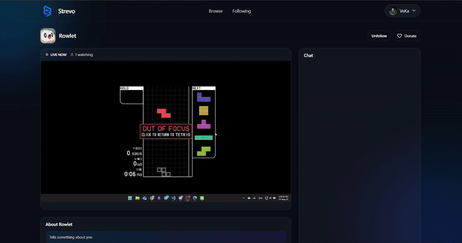
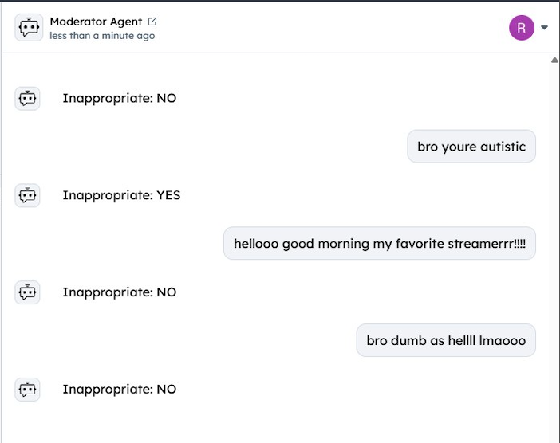
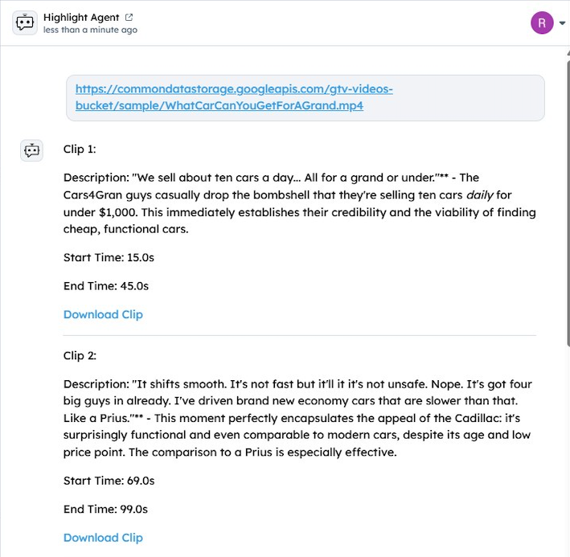

# Strevo




## Introduction

Strevo is a next-generation live streaming platform built on the power of **Web3 and ICP (Internet Computer Protocol)**. Unlike traditional platforms, Strevo allows users to log in seamlessly with their crypto wallets – including **AstroX Me, Plug Wallet, Infinity Wallet, and Stoic Wallet** – giving you true ownership and decentralized access.

Support your favorite streamers directly through **wallet-based donations**, making contributions secure, transparent, and borderless.

But Strevo doesn’t stop there. We integrate cutting-edge **AI technology** to enhance both the streaming and viewing experience:

- **AI-Powered Chat Filtering**: Advanced moderation that detects even disguised offensive language to keep communities safe and inclusive.
- **AI Auto-Highlights**: Every stream automatically generates highlight clips, so the best moments are captured and shared effortlessly.

With Strevo, streaming isn’t just interactive—it’s **decentralized, intelligent, and community-driven**.

## Architecture

- **Frontend (React/TS)**
    
    Handles user login via ICP wallets (AstroX Me, Plug, Infinity, Stoic), live HLS playback, chat, and donations.
    
- **Motoko Canister (ICP)**
    
    Stores user identity and social graph (users, followers, following) on-chain, ensuring decentralized ownership.
    
- **Go Backend (Core API)**
    
    Manages streams, chat, categories, viewer history, highlights, and stream history. Provides REST/WS APIs and integrates with storage.
    
- **Streaming Server (Node.js + FFmpeg + NMS)**
    
    Ingests RTMP streams from OBS, transcodes with FFmpeg, serves HLS, and triggers events (publish, stop) to the backend.
    
- **AI Service (Python)**
    
    Provides advanced chat moderation (detecting disguised offensive words) and automatic highlight generation from live streams.


## ICP Features

- Decentralized **user identity** and login via ICP wallets (AstroX Me, Plug, Infinity, Stoic).
- On-chain storage of **user profiles, followers, and following** using Motoko canisters.
- Secure **streaming key management** tied to principal IDs.
- Wallet-based **donations** for transparent and borderless support to streamers.

## [Fetch.ai](http://Fetch.ai) Features

- **Moderator Agent**: Classifies live chat messages as either *playful banter (acceptable)* or *harmful content (unacceptable)*. Powered by **LLMs (ASI:One, Gemini)** for nuanced detection, even when offensive words are disguised.
- **Highlight Agent**: Generates up to 5 highlight clips from a stream VOD, using **Whisper for transcription, FFmpeg for clip extraction, and Gemini for moment analysis**. Provides start/end timestamps, clip URLs, and contextual descriptions.
- Agents communicate via **AgentChatProtocol** (v0.3.0), making moderation and highlight generation scalable and modular.

Moderator:
[Moderator Agent](https://agentverse.ai/agents/details/agent1q07trs7qwy9avqjn89zpgxl09m4q905ezzd6k22spnxeu5wc8m70xa38xvl/profile)


Highlight:
[Highlight Agent](https://agentverse.ai/agents/details/agent1qfjrx8ydryswclh3qzxpz62z7d5hl405a877850620pqzrhnwwclvaem7vf/profile)


## Run the Project

Clone the repository:
```
git clone https://github.com/JonathanMaverick/Strevo.git
```

Start DFX:
```
dfx start --clean --background
```

Set up and run the project:
```
npm run setup   # Install npm packages
npm run start   # Run the program
```

Initialize the Git submodule:
```
git submodule init
git submodule update
```

Run the Go backend:
```
cd streaming-backend/
go run .
```

Run the AI services:
```
cd streaming-ai/
python highlight_agent.py
python highlight_moderator.py
```

Run the streaming server:
```
cd streaming-server/
node index.js
```

## Challenges

- Running **real-time moderation** with Moderator Agent while keeping chat latency low.
- Ensuring **video transcription + highlight extraction** doesn’t overload the pipeline during or right after live streams.
- Synchronizing clip metadata between **Fetch.ai agents** and the **Go backend** (highlight DB).
- Handling **false positives** in chat classification (playful banter wrongly flagged as toxic).
- Managing **AI service scaling** under high traffic or simultaneous streams.

## Future Plans

- Expand **multi-language moderation** with Moderator Agent to serve global audiences.
- Use Highlight Agent not just for post-stream VOD, but also for real-time highlight suggestions during live sessions
- Mobile App (iOS & Android)
- Advanced Creator Dashboard
- Global Launch
- Ad Integration and Subscription

## Technical Difficulties

- Integration between **Go backend, Node.js streaming server, and Python AI services** while maintaining stability.
- Performance trade-off: **Whisper transcription + FFmpeg cutting** can be heavy on long VODs.
- Maintaining **moderation accuracy** with evolving slang, memes, or obfuscation.
- Handling **protocol versioning** between Agentverse agents and Strevo backend services.
